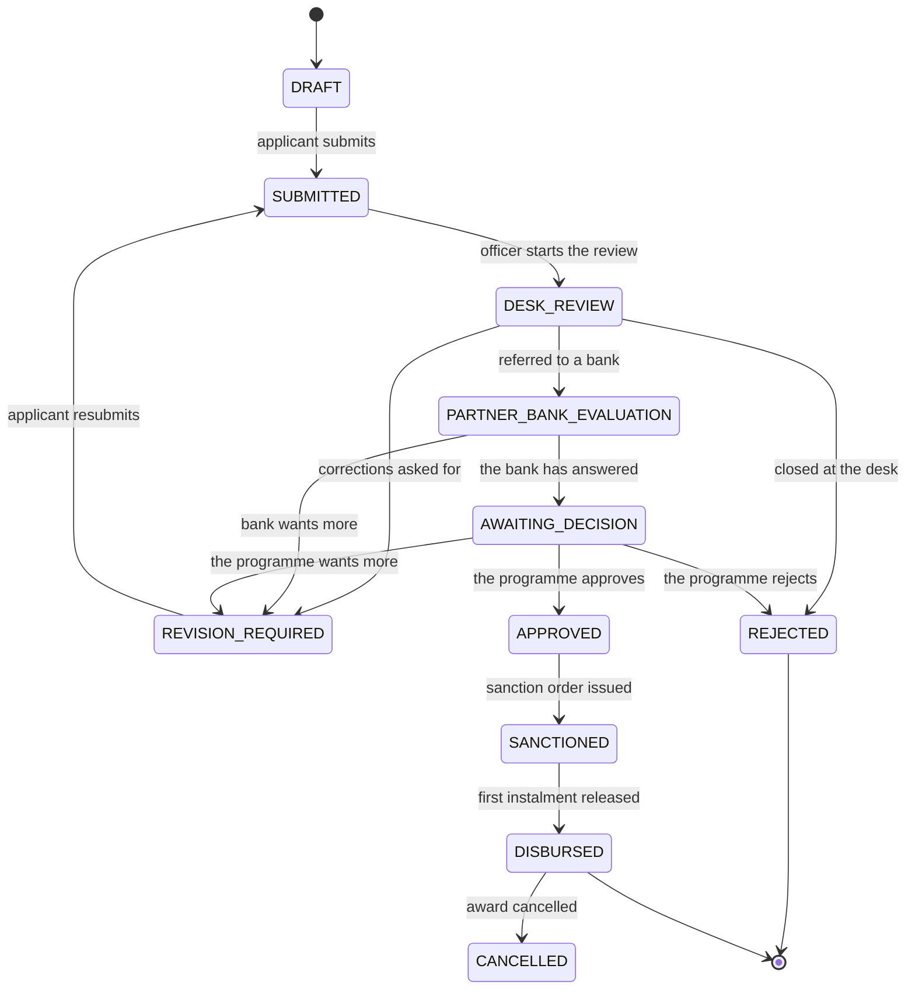

# Mission SEP

TTAADC's Mission SEP gives seed funding to first-generation Scheduled Tribe
entrepreneurs in Tripura's autonomous district areas. This repository is the
API that runs it, plus a browser client for demonstrating and exercising it.

One idea holds the whole system together: **an application is a file, and at
every moment somebody is holding it.** It carries one reference number from the
day it is submitted until the last rupee is accounted for, and every screen and
every operation answers the same question — whose turn is it now?

## The route a file takes

Four desks, eleven states.



| Desk | Holds |
| --- | --- |
| **Applicant** | `DRAFT`, `REVISION_REQUIRED` |
| **Programme office** | `SUBMITTED`, `DESK_REVIEW`, `APPROVED`, `SANCTIONED`, `DISBURSED`, `REJECTED`, `CANCELLED` |
| **Partner bank** | `PARTNER_BANK_EVALUATION` |
| **Decider** | `AWAITING_DECISION` |

---

## What an applicant can do

In the order they do it. Every action names the operation that performs it, and
all of them require the `APPLICANT` role.

| # | What they do | Operation |
| --- | --- | --- |
| 1 | Sign up with an emailed one-time code, then set a password | `auth.startApplicantSignup`, `auth.verifyApplicantSignup` |
| 2 | Register the enterprise the application is for | `seb.enterprise.create` |
| 3 | See which programme cycles are open to apply in | `seb.application.availableProgrammeCycles` |
| 4 | Start an application — a first one, or a later phase | `seb.application.startInitial`, `startExpansion` |
| 5 | Answer the questions the cycle asks, saved as they type | `seb.application.saveDraft` |
| 6 | Attach evidence, uploaded straight to storage | `seb.application.issueDocumentUpload`, `finalizeDocumentUpload` |
| 7 | Check what is still missing before sending | `seb.application.validate` |
| 8 | Submit, which freezes a copy and issues the reference number | `seb.application.submit` |
| 9 | Watch where it is, in plain language | `seb.application.byId`, `statusGuide`, `timeline` |
| 10 | Answer a correction request — only the named stages unlock | `seb.application.saveDraft`, then `resubmit` |
| 11 | See the award, what has been paid, and what is still to come | `seb.application.funding` |
| 12 | Check whether they qualify for a later phase | `seb.application.expansionEligibility` |

They can also edit or remove an enterprise, delete and restore a draft, and see
their own signed-in devices. What they **cannot** reach is anything under
`admin` or `access` — an applicant opening the programme office is refused, and
told which portal their account can use.

## What the programme office can do

Four staff roles, fixed in code. Adding one requires a schema and service change
rather than a production data edit, so every possible authority is visible in
review.

They are **not ranked**. An approver may record a decision a reviewer may not,
and neither may open a programme cycle. So each operation names the *capability*
it needs, and one file — `auth/capabilities.ts` — decides which roles hold it.
Somebody holding several roles gets the union.

Holding the capability is the whole of it: there is nothing to reserve before
acting on a file. Two officers acting at once are settled by a version guard on
the transition, so one succeeds and the other is told the record changed. What
gates a stage is what the reviewer **types** — the numbers off the documents
they have just read — rather than a button they pressed beforehand.

| Role | Can | Cannot |
| --- | --- | --- |
| Reviewer | Read every casework screen | Change anything at all |
| Approver | Read casework, record and correct the decision | Everything else that writes |
| Administrator | The whole operational workflow | Grant or revoke a role |
| Super administrator | All of the above | — |

### Reviewer

Reads and nothing more: the queues, a workspace, submitted documents, the
funding position, the decisions taken. Every mutation is refused, and the client
draws no control they cannot use.

The role exists because reading a file and deciding it are different jobs, and
somebody preparing a case needs the first without the second.

### Approver

A reviewer's reach, plus exactly two operations: recording the programme
decision and correcting one. Desk review, bank referral, awards and recovery all
stay with an administrator — deciding an application and administering the
programme it belongs to are separate authorities.

### Administrator

| Stage | What they do | Operation |
| --- | --- | --- |
| Intake | Work the nine named queues | `admin.intake.queue`, `queues` |
| | See the filtered intake summarized for reporting | `admin.analytics.summary` |
| | Write a note nobody outside the office sees | `admin.intake.addInternalNote` |
| Desk review | Start it | `admin.intake.startDeskReview` |
| | Record nine checks, transcribe the numbers on the documents, and choose an outcome | `admin.intake.completeDeskReview` |
| | Withdraw a correction request made in error | `admin.intake.cancelRevision` |
| Bank | Refer the file to a partner bank | `admin.decision.referToBank` |
| | Record what the bank wrote back | `admin.decision.recordBankOutcome` |
| | Correct that record without erasing it | `admin.decision.correctBankOutcome` |
| Decision | Decide the application | `admin.decision.recordDecision` |
| | Supersede a decision recorded wrongly | `admin.decision.correctDecision` |
| Money | Issue the sanction order | `admin.funding.createAward` |
| | Release an instalment | `admin.funding.recordRelease` |
| | Correct a payment with a reversal | `admin.funding.reverseRelease` |
| | Record how the money was used | `admin.funding.recordAssessment` |
| | Open, work and close a recovery case | `admin.funding.openRecovery`, `recordRecoveryEntry`, `closeRecovery` |

Programme cycles are absent deliberately: writing a policy year and its form is
`CYCLE_ADMIN` work, which only a super administrator holds.

### Super administrator

Everything an administrator can do, **plus** the programme cycles and the
operations an ordinary administrator must not inherit:

| What they do | Operation |
| --- | --- |
| Write a programme year's policy as a draft, revise it, and open it | `admin.programmeCycle.create`, `updateDraft`, `open` |
| Author the form a draft cycle asks — stages, questions, reusable structures | the nine mutations under `admin.formTemplate` |
| Change the closing time or the guidance an open cycle shows | `admin.programmeCycle.changeClosingTime`, `updateOpenGuidance` |
| Close, archive, soft-delete or restore a cycle | `admin.programmeCycle.close`, `archive`, `softDeleteDraft`, `restoreDraft` |
| Look somebody up by their exact address | `access.userByEmail`, `access.userById` |
| Grant a role, confirming with their own password | `access.grantRole` |
| Revoke a named grant, confirming with their own password | `access.revokeRole` |
| Read the history of who changed what | `audit.events`, `audit.actions` |

The form a cycle asks is configuration, not code — see the
[form template guide](docs/form-template-guide.md).

An administrator who could create administrators would be a super administrator
by another name, which is why granting and revoking stay here.

### Bringing somebody into the office

Anybody who can invite — an administrator or a super administrator — names a
person and a role. That person gets a link and **accepts it themselves**, so the
record always shows they agreed. Their applicant access is exchanged for the
staff role rather than added to it.

An invitation cannot exceed its issuer's authority: an administrator may invite
a reviewer or an approver, a super administrator may also invite an
administrator, and nobody is ever invited to super administrator. Nothing about
the invitation is stored — it travels sealed in the link, and what makes it
single-use is that it only applies while the person is still an applicant.

Three rules make this safe: `APPLICANT` can never be granted, because only
verified signup creates it and one revocation would otherwise strip somebody
permanently; the last usable super administrator cannot be revoked; and there is
deliberately no way to list accounts, so the namespace cannot be used to
enumerate them.

---

## Running it

```bash
npm install
cp .env.example .env.local          # then fill in the required values
npm run db:setup:local              # applies database/schema.sql
npm run local                       # the Worker, on http://localhost:9999
cd dev-web && npm install && npm run local   # the client, on :9990
```

GraphQL is at `http://localhost:9999/graphql`. The client points at the Worker
automatically.

### Configuration

`.env.example` is the checked-in template and documents every variable. Wrangler
loads `.env` then `.env.local`, the later winning, and both are gitignored.

**A leftover `.dev.vars` beats both.** Wrangler reads it first and ignores the
`.env` files entirely when it exists — the first thing to suspect when a change
appears to do nothing.

`AUTH_SECRET` and `IDENTIFIER_SECRET` are required, at least 32 bytes each. The
second is read at first use rather than at startup, so a deployment missing it
looks healthy until the first desk review is completed, which then fails.

`ENVIRONMENT` decides two things: where documents go, and whether one-time
codes are really sent. Unset means local — a deployed environment is always told
what it is — and locally uploads are written by the Worker itself and signup
codes are printed to its log on a line marked `DEV_EMAIL`. Nothing else needs
configuring for either to work.

Set it to `develop` and both want the real thing: four `R2_*` values for a
bucket, and `PINGRAM_API_KEY` with `PINGRAM_NOTIFICATION_TYPE` for delivery.
Missing either, the affected path refuses and says so, rather than quietly
falling back — a deployed system must not write live one-time codes to a log,
and must not accept documents it cannot durably keep.

### The first administrator

The database starts with no administrator, by design. Create one the way a real
deployment does — see the
[bootstrap guide](docs/first-super-admin-bootstrap.md). Once that one-time
route has been used it is closed permanently, so a database whose bootstrap is
already spent needs a `SUPER_ADMIN` row written directly — the guide says how,
and why nothing in this repository does it for you.

### Scripts

| Script | Does |
| --- | --- |
| `local` | The Worker on port 9999 |
| `check` | Typecheck, tests with coverage, `fallow`, every `check:*` guardrail, and the schema check |
| `typecheck` | `tsc --noEmit` |
| `test`, `test:coverage` | The service suite: Vitest on Node against a hermetic Postgres |
| `test:runtime` | What genuinely needs workerd — storage, queue handles, edge limits — in the Workers pool |
| `test:neon` | The service suite against a Postgres named by `TEST_DATABASE_URL` |
| `fallow` | Dead code, duplication and complexity |
| `test:worker` | The isolated Worker the end-to-end suite drives |
| `db:setup:local` | Applies the canonical schema to the local database |
| `db:generate` | Writes the next migration from the Drizzle schema's diff against the chain |
| `db:migrate` | Applies pending migrations to the database `DATABASE_URL` names |
| `db:baseline` | Marks migrations through a named tag as already applied, for a database that already has their shape |
| `db:apply` | Runs one reviewed SQL file against the database `DATABASE_URL` names, in a transaction |
| `db:schema:generate` | Rewrites `database/schema.sql` from the Drizzle schema |
| `db:schema:check` | Fails if the two have diverged, or if the schema will not re-apply |
| `check:sdl` … `check:scanner` | Nine focused guardrails: SDL descriptions, audit actions, insert arity, untyped comparisons, SQL aliases, rate-limit coverage, the document size limit, scanner and deploy configuration |
| `cf-typegen` | Regenerates `worker-configuration.d.ts` |
| `deploy` | Checks the deploy configuration, then `wrangler deploy --minify` |

`database/schema.sql` is generated, never hand-edited: change the Drizzle schema
and run `db:schema:generate`.

---

## Where everything is written down

Four layers, and each subject has exactly one owner. The rule is
[`docs/rules/documentation.md`](docs/rules/documentation.md).

**The programme — what the rules are**

- [Application guide](docs/application-guide.md) — the applicant's journey
- [Administrator workflow guide](docs/admin-workflow-guide.md) — the office's
- [Form template guide](docs/form-template-guide.md) — the dynamic application
  form, end to end
- [RBAC](docs/admin-rbac.md) — roles, grants, and the bootstrap
- [Bootstrap runbook](docs/first-super-admin-bootstrap.md) — the first
  administrator
- [Policy crosswalk](docs/policy-alignment.md) — which rules came from TTAADC,
  which are product decisions, and what is still undecided
- [Roadmap](docs/ROADMAP.md) — what is built and what is not

**The code — how it implements them**

- [Services](src/services/README.md) — the layering rule, and why two layers
  check the same things
- [Applicant service](src/services/application/README.md)
- [Administrative service](src/services/admin/README.md)
- [Authentication service](src/services/auth/README.md)
- [Audit](src/services/audit/README.md) — reading who changed what
- [Storage](src/services/storage/README.md) — a bucket, or this Worker
- [Notifications](src/services/external-notification/README.md)
- [Queue](src/services/queue/README.md) — work done after the response
- [Document scanner](src/services/document-scanner/README.md) — whether a file
  is safe to open
- [GraphQL layer](src/graphql/README.md) — the API surface and its limits
- [Database schema](src/db/schema/README.md) — tables, versions, constraints

**The client** — [dev-web](dev-web/README.md)

**The rules** — [docs/rules](docs/rules/README.md): how documentation is
owned, [what good code looks like here](docs/rules/code.md), and
[what it must protect](docs/rules/security.md)

## How it is built

Cloudflare Workers, Hono, GraphQL Yoga, Drizzle over Neon Postgres through
Hyperdrive, R2 or Cloudinary for documents, and a Queue carrying document-scan
requests. The
Worker has three entrypoints: `fetch`, an hourly `scheduled` handler running
three cleanup jobs, and a `queue` consumer that scans a finalized document.

Five of the nine services exist to be **swapped** — notification, storage,
queue, the document scanner, and the rate limiter. Each is an interface
stated in the programme's own words, with one file per implementation and a
factory that picks by environment. That is what lets the whole portal run on a
machine with nothing configured: documents are written by the Worker itself,
one-time codes are printed rather than sent, and scan requests are drained after
the response.

Everything is refused server-side. The client asks the same capability question
the API does, but only to decide what is *offered*; it is never the security
boundary.

The working agreement for changing any of this is [`AGENTS.md`](AGENTS.md).
