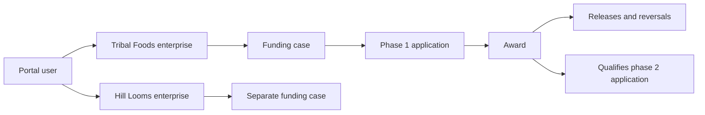
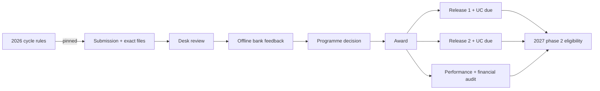
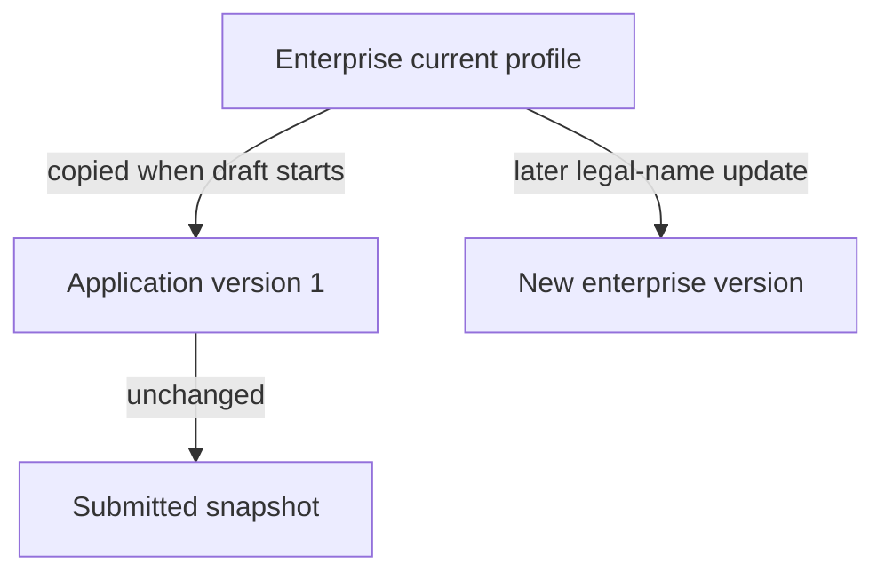
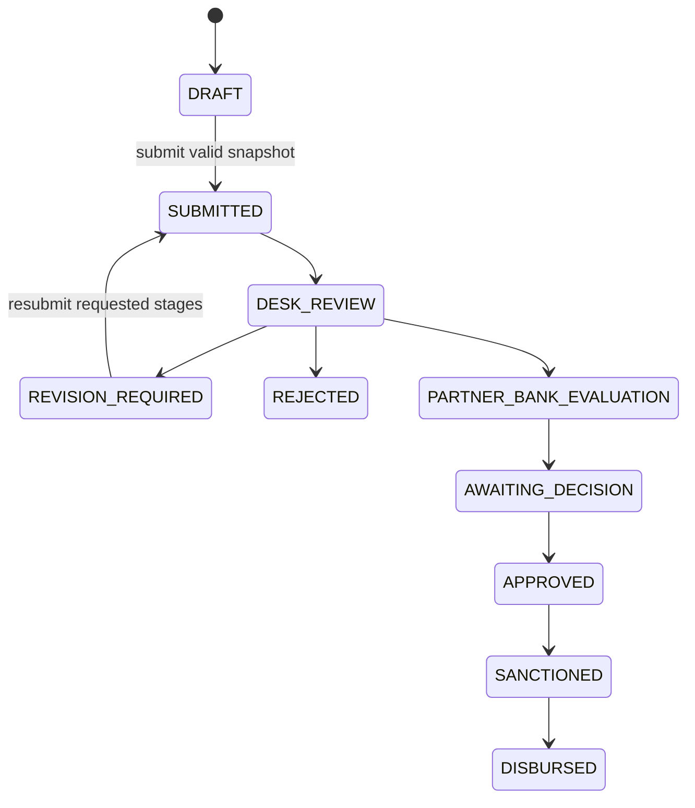

# Mission SEP application guide

This living guide connects the Mission SEP business process to the GraphQL API,
Drizzle schema, Postgres transactions, and private R2 document storage. The
TTAADC policy and application form are authoritative; the UI/UX guide influences
presentation only.

**The questions themselves are not in here.** Which questions a cycle asks, what
they are called and when they appear are declared as a form template frozen with
the cycle version, so this guide describes the machinery rather than the form —
see [the schema README](../src/db/schema/README.md) for the tables and
`src/services/application/form/` for the rules.

## Applicant journey

An applicant creates a portal account, records one or more enterprises, and
starts an initial application during an open programme cycle. Meaningful draft
saves create immutable snapshots. After all required fields and documents are
present, submission freezes a new formal snapshot and reference number for
review. A reviewer may later request revisions to named stages of the form.
Resubmission may change only those stages and is allowed even if the original
cycle has closed.

If a phase receives an active award and retains a positive released amount for
12 calendar months, the next expansion phase may become available. Expansion
is derived from the authoritative award and ledger; the applicant never selects
a Phase-II flag or types prior-award totals.

### Worked example

Rina owns “Tribal Foods” and “Hill Looms” under one `core_user`. Each enterprise
gets its own funding case. She starts Tribal Foods phase 1 in the 2026 cycle,
submits snapshot version 4, and later receives award `SEP/2026/0042`. The first
₹5,00,000 release occurs on 2026-07-15. If ₹1,00,000 is reversed, ₹4,00,000
remains. On 2027-07-15, provided no competing phase-2 application exists, the
service may start an expansion draft in an open cycle. Hill Looms remains an
independent funding chain.



Rina’s 2026 phase-1 draft pins the 2026 rule version. She later updates Tribal
Foods’ current address, but the submitted address stays frozen. Administrator
Meera opens the application and requests a correction to the financial stage; the
new submission freezes only the corrected form plus its exact files. The bank
records “not recommended” with a safe summary, yet the application is still
decided on its merits because bank feedback is advisory evidence. The programme
approves ₹10 lakh.

The award is paid in two releases, so two independent 180-day utilization
obligations exist. Before Rina starts phase 2 in the 2027 cycle, both retained
releases must have passed utilization results and the award must have passed
performance and financial audit. If the first release is fully reversed, its
date and utilization obligation stop gating expansion; a partial reversal keeps
both. If the award is later cancelled with net funds, staff open recovery,
record an official principal demand and externally calculated penal interest,
then append receipts or waivers until the derived balance reaches zero.
Award closure records whether every planned release was completed or a
remaining sanction will not be released. A recovery opened by mistake may be
cancelled only before its first ledger entry; later corrections use
compensating entries and the case closes only at zero balance.



## Finding things in a list

An applicant's enterprises and applications are both paged lists. Enterprises
can be narrowed by status and sector, applications by enterprise, status, cycle
and type, and both by the start of a name or reference number — a prefix match,
which is what the label promises.

Each list reports its total, so a page says where it sits and an empty result
can distinguish "nothing matches these filters" from "nothing here yet".

## Entity glossary

| Entity | Meaning and owner | Storage behavior | Example |
| --- | --- | --- | --- |
| User | Verified portal identity; created by signup | Soft-deleted; sessions hard-delete | `rina@example.in` |
| Enterprise | Current canonical business profile owned by one user | Mutable head + immutable versions + soft delete | Tribal Foods |
| Funding case | Long-lived funding chain for one enterprise | One versioned root per enterprise | All Tribal Foods phases |
| Programme cycle | Versioned policy/application window | Administrator-managed versioned root | `SEP-2026` |
| Application | One phase attempt in one cycle | Versioned workflow head + soft delete while draft | Initial phase 1 |
| Application version | Complete form snapshot | Append-only | Draft v3 / submission v4 |
| Submission | Formal version plus the exact document versions sent for review | Append-only | Submission 1 → v4 + DPR v2 |
| Assignment | Who worked the file last — a record, not a lock | Current pointer + append-only history | Meera starts the desk review |
| Desk review | TTAADC’s KYC, evidence, completeness, and DPR scrutiny | Append-only checklist/outcome | All applicable checks pass |
| Document slot | Current logical evidence type | Versioned head + soft delete | Current DPR |
| Document version | One finalized private R2 object | Append-only | DPR replacement v2 |
| Revision request | Reviewer request for one stage of the form | Immutable request with resolution/cancellation lifecycle | Correct financial data |
| Bank referral | Exact submission sent to a named offline partner bank | Versioned operational root | Tripura Gramin Bank referral 18 |
| Bank outcome | Bank feedback read when deciding | Append-only and superseding corrections | Recommended |
| Programme decision | Approval, rejection, or revision, pinning the submission and bank outcome read | Append-only and superseding corrections | Approved ₹10 lakh |
| Award | Authoritative sanction for one application | Versioned, soft-deleted root | `SEP/2026/0042` |
| Disbursement | Release or compensating reversal | Append-only ledger | ₹5 lakh release |
| Utilization obligation | Evidence deadline for one release | Append-only | Release 2 due in 180 days |
| Assessment | Numbered result by award or release obligation | Append-only; latest scoped number is current | Utilization passed #2 |
| Qualifying award | Earlier award selected for one expansion attempt | Versioned link; cancelled when released/retried | Phase 1 award → phase 2 |
| Recovery case | Official demands and settlements after award cancellation | Versioned root + append-only ledger | Principal demand and receipt |

## Canonical profile and frozen snapshots



The enterprise head answers “what is current now?” An application version
answers “what did the applicant save or submit then?” Existing application
snapshots never follow later enterprise edits.

## Draft and review states



Applicants perform draft, submit, and resubmit transitions. Authorized staff
continue through the separate `admin` namespace; see the
[administrator workflow guide](admin-workflow-guide.md).

### Knowing what to do next

`seb.application.statusGuide` returns a label, plain-language explanation, next
actor (`APPLICANT`, `PROGRAMME_OFFICE`, or `NOBODY`), and next action for every
status. It is built from the schema's own status list, so a status added to the
workflow cannot be missing from it, and it deliberately carries no dates: a
status says who holds the work, never when they will finish it.

### Knowing what may be edited

`Application.editableStageKeys` lists the stages the applicant may change right
now — every stage the form declares while the application is a draft, only the
stages named by unresolved revision requests while revision is required, and none
otherwise. It is derived from the same rule the draft-save path enforces, so it
can never invite an edit the write would refuse.

Before resubmitting, `seb.application.draftChanges` names the stages the current
draft changes relative to the last submission, using the same comparison the
administrative workspace shows a reviewer. The server-stamped declaration
acceptance time is excluded, so an edit to one stage never reports the
declaration as changed too.

## The form is the cycle's, not the schema's

There is no fixed list of questions. A programme cycle declares its own form —
stages, questions, choices, bounds and conditions — and that declaration is
frozen with the cycle version each application pins, so a submission stays
readable against exactly the questions it was asked.

`seb.application.formTemplate` returns it. Every question carries a `key`, and
that one string is how it is addressed everywhere: in `answers`, in the DOM `id`
the client puts on the control, and in a `ValidationIssue.field`. A member of a
repeated group is addressed `GROUP[0].MEMBER`, indexed from 0.

`Application.answers` is the answer map, keyed by question. A save replaces the
whole map: every question the form asks must be an own property, an explicit
`null` clears one, and both an unknown key and a missing one are refused rather
than quietly dropped.

**Six questions keep fixed keys**, because code that is not template-aware still
has to find them: the business name, its sector, the application category, the
establishment date, the applicant's date of birth, and the seed fund requested.
A cycle chooses their labels, help text, stage, position and choices — only the
key is fixed. Everything else is the cycle's to name.

Documents are `FILE` questions. Which documents an application can carry, and
which are required, are therefore the cycle's decisions too, expressed as
ordinary conditions against whatever questions it happens to declare.

There is no ST certificate number question in the default form. The certificate
itself remains a required document, and a cycle may add the number if the
programme decides it wants one.

## Validation and evidence

**What is required is the cycle's decision.** Every rule below that used to be
written here — always-required answers, and the four conditional document rules
— is now something a cycle declares: a question is `REQUIRED`, `OPTIONAL`, or
`CONDITIONAL` on a rule naming another question. The software enforces whatever
the cycle declares, and nothing beyond it.

The default form reproduces the rules Mission SEP has used: registration number
and file when the enterprise is registered, a GST file when a GSTIN is supplied,
a sector description for "other", scheme/amount/year when prior funding is
declared, bank/amount/status when existing credit is, and a no-objection
certificate when one applies.

Three rules are **not** the cycle's to express as field bounds, because their
inputs are cycle scalars rather than answers, and they read their inputs through
the role bindings: the applicant age range, the Category A/B cutoff, and the
funding ceiling.

The numbers themselves are the **cycle's**, not the software's: 18 through 60
and 24 months are the defaults a cycle version starts from, and each cycle
declares its own. Age is judged across the owners — at least one owner must be
in the band, so a founder of 30 with a retired parent as co-owner is not
refused for the member the rule was never about. The category is computed by
the server at submission from the enterprise's establishment date: Category A
is the established side, trading for at least the cycle's threshold; Category
B is everything younger. An enterprise registered without an establishment
date cannot be sorted, and submission is refused with a message pointing at
the enterprise screen. Category A/B describes enterprise maturity and is
independent of `INITIAL`/`EXPANSION`, which describes funding phase.

Money is exact integer paise and never floating point. Dates are real ISO
`YYYY-MM-DD` calendar dates. Email is trimmed/lowercased, GSTIN and registration
identifiers are uppercased, and phone formatting characters are removed.
Financing components do not have to sum to project cost. No contradictory
seed-fund ceiling from the source documents is hard-coded.

## Expansion calculations and retries

The service selects an active award from the immediately preceding phase in the
same enterprise/funding case. For each release, related reversals are
subtracted.
At least one release must retain a positive amount, total net disbursement must
be positive, and the target cycle’s UTC calendar waiting period after the first
retained release must have arrived. Every retained release’s latest utilization
assessment plus the latest performance and financial-audit assessments must
meet the target cycle’s required outcomes.

Eligibility reports each unmet gate separately, as a code, an applicant-safe
message, and — for utilization — the release obligation it is about:
`NO_QUALIFYING_AWARD`, `QUALIFYING_AWARD_NOT_ACTIVE`, `NO_POSITIVE_RELEASE`,
`TWELVE_MONTH_WAIT_NOT_COMPLETE`, `UTILIZATION_NOT_PASSED`,
`PERFORMANCE_NOT_PASSED`, `FINANCIAL_AUDIT_NOT_PASSED`, and
`COMPETING_PHASE_APPLICATION`. The first three are distinguished rather than
collapsed because “you have never been sanctioned”, “your award is suspended”,
and “nothing has actually been paid out” are three different things to act on.
`eligibleAt` carries the first calendar instant the waiting rule is satisfied.

Example: a release on 2024-02-29 reaches its 12-month calendar anniversary on
2025-02-28. A full reversal removes that release from eligibility; a partial
reversal keeps its original release date. Only one non-rejected attempt for a
phase can be active. A rejected attempt may retry in a later open cycle; its old
qualifying link is cancelled in the same transaction that creates the replacement.

## Documents and R2


The signed request includes content length, content type, SHA-256, and
`If-None-Match: *`. The browser derives the signed content length from the Blob;
frontend code does not manually set that forbidden header. Opaque object keys
contain no applicant name or original filename. PDF, JPEG, and PNG files are
allowed up to 2 MB. Download links last five minutes, force
attachment, and never make the bucket public. Replacing or logically deleting a
slot does not delete immutable finalized objects.

## Seeing the funding outcome

Once an administrator sanctions an application, `seb.application.funding`
returns what the award has actually paid out. Every amount is derived from the
append-only disbursement ledger rather than stored, so it cannot drift from the
releases and reversals behind it:

- the sanction order, date, amount, status, closure disposition, and
  applicant-safe conditions;
- gross released, reversed, net released, and remaining planned amounts, the
  last clamped at zero because a corrected award can be amended below what was
  already released;
- each payment with its date, amount, safe payment reference, and how much of it
  was reversed — the reversal is folded into the release it corrects rather than
  listed as its own ledger entry; and
- each assessment with its type, number, outcome, applicant-safe summary, and
  whether it is the current result. Utilization is assessed once per release, so
  more than one utilization result can be current at the same time.

Programme-office detail never leaves the server: release approval references,
bank-account verification, performance agreements, physical verification,
evidence references, internal notes, recovery cases, and award version history
are all absent from this view.

## Confirmation emails and the PDF copy

At three moments the applicant is emailed without asking: when a submission or
resubmission succeeds, when the programme approves the application, and when
the award is sanctioned. Each message attaches a PDF of the application as it
was submitted — the questions the cycle asked and the answers given, rendered
so the applicant has a copy to keep, print, or hand to a bank. The approval
and sanction messages state the approved or sanctioned amount.

The email is **best-effort, after the fact**. The write it reports on has
already succeeded before any email is attempted, and a transport or rendering
failure can never undo it or surface as an error to anybody — what it does
instead is leave a failure audit record under its own action, so an applicant
who says "I never got the confirmation" has an answerable question. Nothing
about the outcome depends on the email arriving; the portal remains the
authoritative view.

## Programme cycles the applicant can see

`availableProgrammeCycles` is the only list a “start application” action may be
offered from: it contains the cycles a new application can be started in right
now. `myProgrammeCycles` returns the cycles the applicant already has work in,
whatever their state, so closed and archived cycles render as read-only history.
Keeping them separate is what stops a closed cycle from ever carrying a start
action. Both expose the cycle code, display name, year, policy reference,
applicant guidance, lifecycle status, and application window.

## Deleting an enterprise

An enterprise can be removed only once nothing depends on it. A refused deletion
returns `blockers`, naming the exact applications in the way with their
reference numbers, statuses, and whether they carry an award — so the applicant
knows which draft to remove rather than guessing. The list is scoped to the
caller's own applications, so it cannot be used to probe somebody else's
history, and the field is present and empty on every other outcome.

## GraphQL examples

```graphql
mutation CreateEnterprise($input: EnterpriseProfileInput!) {
  seb { enterprise { create(input: $input) { success message response { id currentVersion } } } }
}

mutation Start($input: StartApplicationInput!) {
  seb { application { startInitial(input: $input) { success message response { id currentVersion statusVersion } } } }
}

mutation Save($input: SaveApplicationDraftInput!) {
  seb { application { saveDraft(input: $input) { success message response { id currentVersion } } } }
}

query Validate($id: ID!) {
  seb { application { validate(applicationId: $id) { success response { valid issues { stageKey field code message } } } } }
}

mutation Submit($input: ApplicationVersionInput!) {
  seb { application { submit(input: $input) { success message response { referenceNumber status } } } }
}

query Funding($id: ID!) {
  seb { application { funding(applicationId: $id) { success message response {
    award { sanctionOrderNumber sanctionedAmountPaise netReleasedPaise remainingPlannedPaise status }
    releases { sequenceNumber occurredAt amountPaise paymentReference reversedAmountPaise }
    assessments { assessmentType assessmentNumber outcome summary latest }
  } } } }
}
```

Only one action is allowed beneath `mutation.seb`, including actions introduced
by aliases or fragments. Expected failures use `success: false`, a safe message,
and `response: null`; malformed documents and unexpected faults use GraphQL
errors.

Common expected failures include missing authentication, another applicant's
ID, stale expected versions, closed cycles, competing phase attempts, invalid
or missing evidence, expired upload intents, and changes outside requested
revision stages.

## Concurrency, history, and audit

A transaction is atomic, but a zero-row guarded update is not itself an error.
The [applicant service README](../src/services/application/README.md) explains
the write-time predicates and failure-recovery state machines in detail.
Dependent inserts therefore use `INSERT ... SELECT ... WHERE EXISTS` predicates
tied to the winning root update. Batches remain bounded; cleanup is paginated.

Business roots soft-delete; sessions alone hard-delete. Versions, submissions,
events, ledgers, and assessments are append-only. Safe audit metadata includes
`{ "phaseNumber": 2, "type": "EXPANSION" }`. Unsafe metadata includes form
answers, names, filenames, object keys, URLs, checksums, passwords, OTPs, or
session/challenge digests.

## Setup, testing, and limitations

Regenerate the canonical empty-database schema with `npm run db:schema:generate`
and verify drift with `npm run db:schema:check`. Build or update any database
with `npm run db:migrate` (override `DATABASE_URL` inline for one that is not
the deployed database), `npm test` for the service suite, `npm run
test:coverage` for the application coverage gate, and `npm run check` for the
complete gate.

A deployed database exists, so every schema change travels as an incremental
migration under `database/migrations/` (`db:generate`, then `db:migrate`); the
chain is never rewritten. Its single `0000_baseline` is the residue of a
development-era consolidation performed before real data, with every existing
database converged first. Programme-cycle administration, intake, desk
review, bank evidence, programme decisions, awards, payments, assessments, and
recovery now exist under the administrator namespace, and role administration
under the `access` namespace. Rate limiting, account recovery, best-effort
email notification with a PDF copy of the application, and a real malware
scanner behind the configuration seam are delivered. Idempotency keys, the
production scanner key, payment integration, and public deployment remain
excluded. Storage CORS and bucket-scoped credentials are required outside
tests. Staff document downloads remain fail-closed until the scanner records
`ACCEPTED`.

The authoritative-policy differences and unresolved ceiling/jurisdiction
questions are tracked in the [policy alignment crosswalk](policy-alignment.md).
