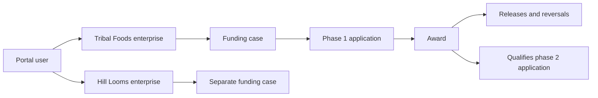
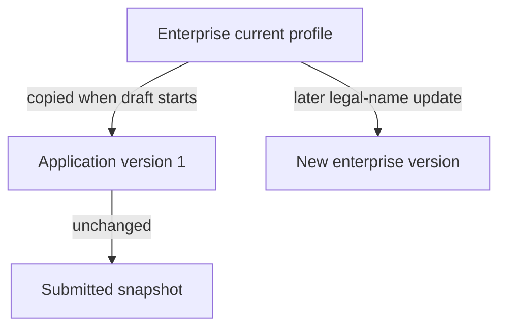
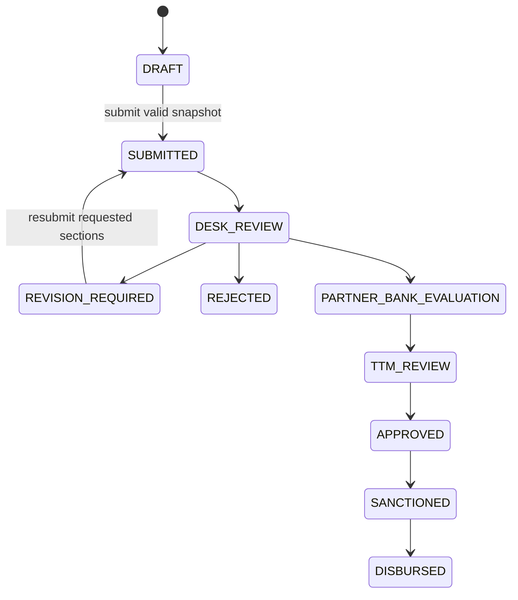
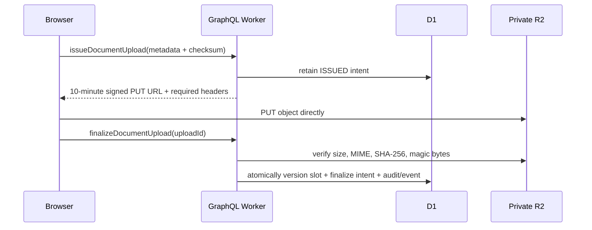

# Mission SEP application guide

This living guide connects the Mission SEP business process to the GraphQL API,
Drizzle schema, D1 transactions, and private R2 document storage. The TTAADC
policy and application form are authoritative; the UI/UX guide influences
presentation only.

## Applicant journey

An applicant creates a portal account, records one or more enterprises, and
starts an initial application during an open programme cycle. Meaningful draft
saves create immutable snapshots. After all required fields and documents are
present, submission freezes a new formal snapshot and reference number for
review. A reviewer may later request revisions to named sections. Resubmission
may change only those sections and is allowed even if the original cycle has
closed.

If a phase receives an active award and retains a positive released amount for
12 calendar months, the next expansion phase may become available. Expansion
is derived from the authoritative award and ledger; the applicant never selects
a Phase-II flag or types prior-award totals.

### Worked example

Rina owns “Tribal Foods” and “Hill Looms” under one `core_user`. Each enterprise
gets its own funding case. She starts Tribal Foods phase 1 in the 2026 cycle,
submits snapshot version 4, and later receives award `SEP/2026/0042`. The first
₹5,00,000 release occurs on 2026-07-15. If ₹1,00,000 is reversed, ₹4,00,000
remains. On 2027-07-15, provided no competing phase-2 application exists, the
service may start an expansion draft in an open cycle. Hill Looms remains an
independent funding chain.



## Entity glossary

| Entity | Meaning and owner | Storage behavior | Example |
| --- | --- | --- | --- |
| User | Verified portal identity; created by signup | Soft-deleted; sessions hard-delete | `rina@example.in` |
| Enterprise | Current canonical business profile owned by one user | Mutable head + immutable versions + soft delete | Tribal Foods |
| Funding case | Long-lived funding chain for one enterprise | One versioned root per enterprise | All Tribal Foods phases |
| Programme cycle | Versioned policy/application window | Administrator-managed versioned root | `SEP-2026` |
| Application | One phase attempt in one cycle | Versioned workflow head + soft delete while draft | Initial phase 1 |
| Application version | Complete form snapshot | Append-only | Draft v3 / submission v4 |
| Submission | Formal pointer to one exact version | Append-only | Submission 1 → v4 |
| Document slot | Current logical evidence type | Versioned head + soft delete | Current DPR |
| Document version | One finalized private R2 object | Append-only | DPR replacement v2 |
| Revision request | Reviewer request for one section | Immutable request with resolution/cancellation lifecycle | Correct financial data |
| Award | Authoritative sanction for one application | Versioned, soft-deleted root | `SEP/2026/0042` |
| Disbursement | Release or compensating reversal | Append-only ledger | ₹5 lakh release |
| Assessment | Numbered review result by type | Append-only; latest number is current | Utilization passed #2 |
| Qualifying award | Earlier award selected for one expansion attempt | Versioned link; cancelled when released/retried | Phase 1 award → phase 2 |

## Canonical profile and frozen snapshots



The enterprise head answers “what is current now?” An application version
answers “what did the applicant save or submit then?” Existing application
snapshots never follow later enterprise edits.

## Draft and review states



Applicants currently perform only draft, submit, and resubmit transitions.
Administrative transitions are deliberately not exposed by this service.

## Form-to-schema mapping

| Form section | GraphQL draft object | `seb_application_version` columns |
| --- | --- | --- |
| Enterprise | `enterprise` | `business_name`, establishment, registration, GSTIN, sector, category, majority ownership |
| Promoter/applicant | `applicantProfile` | name, designation, birth date, gender, address, PIN, phone, email |
| Financial proposal | `financial` | total cost, seed request, bank loan, promoter contribution (all paise) |
| Prior support/credit | `priorFunding` | declared scheme/amount/year and bank/credit/status |
| Evidence applicability | `documents` | `noc_required`; actual files use document tables |
| Declaration | `declaration` | relationship, related person, acceptance, server acceptance time, place |
| Expansion history | server-derived | prior sanction/date, net disbursement, operation months |

There is no ST certificate number field. The certificate itself remains a
required document.

## Validation and evidence

Always required at submission: enterprise classification, promoter identity and
contact, address, financial values, prior-funding answers, declaration, identity
/ age proof, ST certificate, address proof, DPR, and bank details.

Conditional rules:

| Condition | Required data/evidence |
| --- | --- |
| Registered enterprise | Registration number and business-registration file |
| GSTIN supplied | GST-registration file |
| Other sector | Sector description |
| Prior government funding = yes | Scheme, positive amount, sanction year |
| Existing bank credit = yes | Bank, positive amount, `STANDARD`/`NPA` |
| NOC required = yes | NOC file |

Applicants must be 18 through 60 inclusive. Category A means proposed or no
more than 24 calendar months established; Category B means older than 24
months. Category A/B describes enterprise maturity and is independent of
`INITIAL`/`EXPANSION`, which describes funding phase.

Money is exact integer paise and never floating point. Dates are real ISO
`YYYY-MM-DD` calendar dates. Email is trimmed/lowercased, GSTIN and registration
identifiers are uppercased, and phone formatting characters are removed.
Financing components do not have to sum to project cost. No contradictory
seed-fund ceiling from the source documents is hard-coded.

## Expansion calculations and retries

The service selects an active award from the immediately preceding phase in the
same enterprise/funding case. For each release, related reversals are subtracted.
At least one release must retain a positive amount, total net disbursement must
be positive, and the UTC calendar anniversary 12 months after the first retained
release must have arrived. Assessments remain visible history but do not gate
eligibility in the current agreed rule.

Example: a release on 2024-02-29 reaches its 12-month calendar anniversary on
2025-02-28. A full reversal removes that release from eligibility; a partial
reversal keeps its original release date. Only one non-rejected attempt for a
phase can be active. A rejected attempt may retry in a later open cycle; its old
qualifying link is cancelled in the same D1 batch that creates the replacement.

## Documents and R2



The signed request includes content length, content type, SHA-256, and
`If-None-Match: *`. The browser derives the signed content length from the Blob;
frontend code does not manually set that forbidden header. Opaque object keys
contain no applicant name or original filename. PDF, JPEG, and PNG files are
allowed up to 10 MB. Download links last five minutes, force
attachment, and never make the bucket public. Replacing or logically deleting a
slot does not delete immutable finalized objects.

## GraphQL examples

```graphql
mutation CreateEnterprise($input: EnterpriseProfileInput!) {
  seb { enterprise { create(input: $input) { success message response { id currentVersion } } } }
}

mutation Start($input: StartApplicationInput!) {
  seb { application { startInitial(input: $input) { success message response { id currentVersion statusVersion } } } }
}

mutation Save($input: SaveApplicationDraftInput!) {
  seb { application { saveDraft(input: $input) { success message response { id currentVersion } } } }
}

query Validate($id: ID!) {
  seb { application { validate(applicationId: $id) { success response { valid issues { section field code message } } } } }
}

mutation Submit($input: ApplicationVersionInput!) {
  seb { application { submit(input: $input) { success message response { referenceNumber status } } } }
}
```

Only one action is allowed beneath `mutation.seb`, including actions introduced
by aliases or fragments. Expected failures use `success: false`, a safe message,
and `response: null`; malformed documents and unexpected faults use GraphQL
errors.

Common expected failures include missing authentication, another applicant's
ID, stale expected versions, closed cycles, competing phase attempts, invalid
or missing evidence, expired upload intents, and changes outside requested
revision sections.

## Concurrency, history, and audit

D1 batches are atomic, but a zero-row guarded update is not itself an error.
The focused [application integrity guide](application-integrity.md) explains
the write-time predicates and failure-recovery state machines in detail.
Dependent inserts therefore use `INSERT ... SELECT ... WHERE EXISTS` predicates
tied to the winning root update. Batches remain bounded; cleanup is paginated.

Business roots soft-delete; sessions alone hard-delete. Versions, submissions,
events, ledgers, and assessments are append-only. Safe audit metadata includes
`{ "phaseNumber": 2, "type": "EXPANSION" }`. Unsafe metadata includes form
answers, names, filenames, object keys, URLs, checksums, passwords, OTPs, or
session/challenge digests.

## Setup, testing, and limitations

Regenerate the canonical empty-database schema with `npm run db:schema:generate`
and verify drift with `npm run db:schema:check`. Use `npm run db:setup:local` for
local D1, `npm test` for Worker integration tests, `npm run test:coverage` for
the application coverage gate, and `npm run check` for the complete gate.

The base schema is replaceable because no production database exists; no
incremental migration is added. Programme-cycle provisioning, review actions,
award/payment administration, notifications, idempotency, rate limiting,
malware scanning, and public deployment are excluded. R2 CORS and bucket-scoped
credentials are required outside tests. Do not enable administrator document
access until malware scanning exists.
