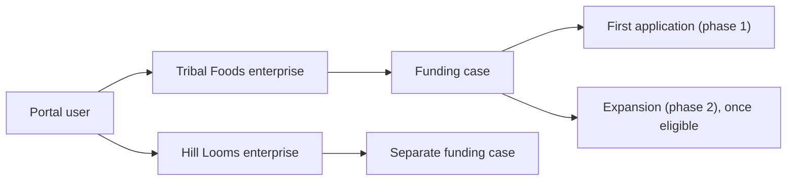
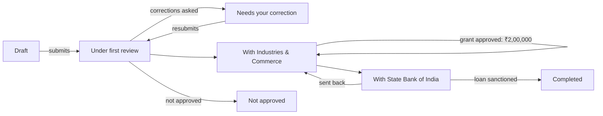
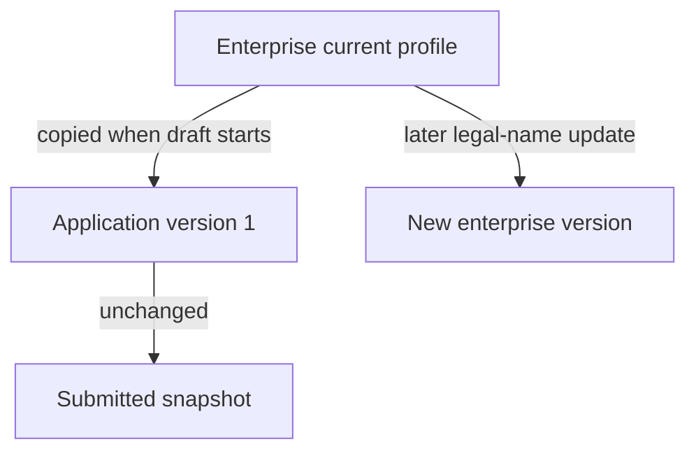
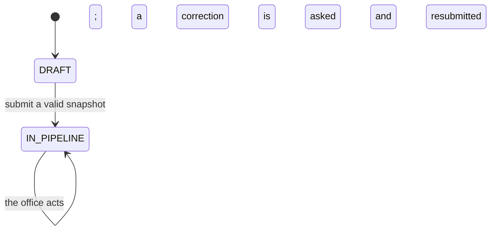
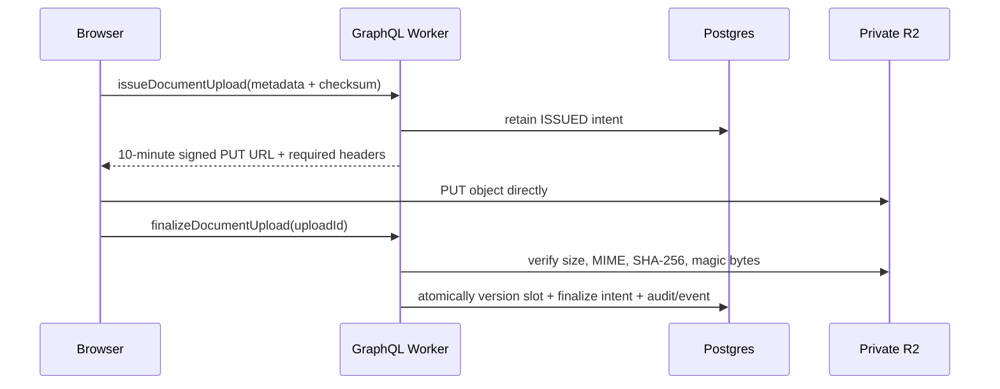

# Mission SEP application guide

This living guide connects the Mission SEP business process to the GraphQL API,
Drizzle schema, Postgres transactions, and private R2 document storage. The
TTAADC policy and application form are authoritative; the UI/UX guide influences
presentation only.

**The questions themselves are not in here.** Which questions a cycle asks, what
they are called and when they appear are declared as a form template frozen with
the cycle version, so this guide describes the machinery rather than the form —
see [the schema README](../src/db/schema/README.md) for the tables and
`src/services/application/form/` for the rules.

## Applicant journey

An applicant creates a portal account, records one or more enterprises, and
starts an application of one of the **kinds** an open programme cycle offers.
Meaningful draft saves create immutable snapshots. After all required answers
and documents are present, submission freezes a formal snapshot, issues a
reference number, and hands the file to the programme office's **pipeline**.
The office may ask for corrections to named sections of the form. Resubmission
may change only those sections, is allowed even if the cycle has closed, and
returns the file to the stage that asked.

The default form asks four sections — Owners, Funding requested, Previous
support, and the documents — after the enterprise's own profile, which lives on
the enterprise rather than in the form. Every editable section uses
`Save & Next`: pending answers or uploads finish first, fresh server validation
must pass for that section, and only then does the journey advance. Review
shows all answers and attached files before the applicant submits.

**Funding requested** is where the applicant asks for a grant, a bank loan, or
both:
- "Do you want a grant?" — and if so, the desired grant amount;
- "Do you want a bank loan?" — and if so, a first choice of bank (State Bank of
  India or Tripura Gramin Bank), an optional second choice, and the loan
  amount.

Two rules about several answers hold the section together: at least one of a
grant or a loan must be asked for, and the two banks must differ. The form
shows a broken rule as soon as the answers break it, and submission refuses it
with `FORM_RULE_VIOLATED`. How rules work is in the
[form template guide](form-template-guide.md#rules-about-several-answers-at-once).

**Which kinds may be started is the cycle's decision.** Each kind carries
eligibility rules — for example, an expansion only for an enterprise whose
earlier application was approved a grant at least twelve months ago — and the
applicant is shown every reason a kind is closed to them, not just the first.
The rules and when they are asked are in the
[form template guide](form-template-guide.md#kinds-of-application-and-who-may-start-one).

### Worked example

Rina owns "Tribal Foods" and "Hill Looms" under one `core_user`. Each
enterprise gets its own funding case, the chain its applications belong to. The
2026 cycle offers two kinds, a first application and an expansion. She starts a
first application for Tribal Foods, asks for a ₹2,00,000 grant and a
₹5,00,000 loan with State Bank of India as her first choice, and submits
snapshot version 4 as `SEP-2026-…`. Hill Looms remains an independent chain.


```mermaid
flowchart LR
  U["Portal user"] --> E1["Tribal Foods enterprise"]
  U --> E2["Hill Looms enterprise"]
  E1 --> C1["Funding case"]
  C1 --> A1["First application (phase 1)"]
  C1 --> A2["Expansion (phase 2), once eligible"]
  E2 --> C2["Separate funding case"]
```

Rina's draft pins the 2026 cycle version. She later updates Tribal Foods'
address, but the submitted snapshot stays frozen. Her file is then worked
through the cycle's pipeline, and this is what she sees at each step of the
shipped route:


```mermaid
flowchart LR
  D["Draft"] -->|"submits"| T["Under first review"]
  T -->|"corrections asked"| R["Needs your correction"]
  R -->|"resubmits"| T
  T --> I["With Industries & Commerce"]
  I -->|"grant approved: ₹2,00,000"| I
  I --> B["With State Bank of India"]
  B -->|"sent back"| I
  B -->|"loan sanctioned"| C["Completed"]
  T -->|"not approved"| X["Not approved"]
```

The office at TTC asks her to correct the Funding requested section. Only that
section unlocks; she corrects it and resubmits, and the file goes back to TTC,
not to the start. Industries & Commerce approves ₹2,00,000 — her application
now shows "Grant approved" and the amount — and sends the file to her first
choice of bank. The bank sanctions the loan, recording the amount, its
reference and the date, and her application reads "Completed" with everything
the office decided listed beside it. None of the office's own notes, inputs or
internal statuses reach her screen.

## Finding things in a list

An applicant's enterprises and applications are both paged lists. Enterprises
can be narrowed by status and sector, applications by enterprise, status, cycle
and kind, and both by the start of a name or reference number — a prefix match,
which is what the label promises.

Each list reports its total, so a page says where it sits and an empty result
can distinguish "nothing matches these filters" from "nothing here yet".

## Entity glossary

| Entity | Meaning and owner | Storage behavior | Example |
| --- | --- | --- | --- |
| User | Verified portal identity; created by signup | Soft-deleted; sessions hard-delete | `rina@example.in` |
| Enterprise | Current canonical business profile owned by one user | Mutable head + immutable versions + soft delete | Tribal Foods |
| Funding case | Long-lived chain of one enterprise's applications | One versioned root per enterprise | All Tribal Foods phases |
| Programme cycle | Versioned policy/application window | Administrator-managed versioned root | `SEP-2026` |
| Application | One attempt, of one of the cycle's kinds, in one cycle | Versioned head carrying its pipeline stage, flags and recorded values; soft delete while draft | First application, phase 1 |
| Application version | Complete form snapshot | Append-only | Draft v3 / submission v4 |
| Submission | Formal version plus the exact document versions sent for review | Append-only | Submission 1 → v4 + DPR v2 |
| Document slot | Current logical evidence type | Versioned head + soft delete | Current DPR |
| Document version | One finalized private R2 object | Append-only | DPR replacement v2 |
| Revision request | The office's request to correct one section of the form | Immutable request with resolution/cancellation lifecycle | Correct the funding requested |
| Stage action | One action an officer took at a pipeline stage: what they entered, and what it changed | Append-only | "Approve the grant", ₹2,00,000 |

## Canonical profile and frozen snapshots


```mermaid
flowchart TD
  E["Enterprise current profile"] -->|"copied when draft starts"| V1["Application version 1"]
  E -->|"later legal-name update"| EV["New enterprise version"]
  V1 -->|"unchanged"| S["Submitted snapshot"]
```

The enterprise head answers “what is current now?” An application version
answers “what did the applicant save or submit then?” Existing application
snapshots never follow later enterprise edits.

## Draft and in the pipeline


```mermaid
stateDiagram-v2
  [*] --> DRAFT
  DRAFT --> IN_PIPELINE: submit a valid snapshot
  IN_PIPELINE --> IN_PIPELINE: the office acts; a correction is asked and resubmitted
```

An application has only two states of its own. `DRAFT` is the applicant's;
`IN_PIPELINE` is everything after the first submission. Where the file is
within the pipeline, whether a correction is waiting on the applicant, and how
it ended are not states: they are the **journey**.

`Application.journey` (and `ApplicationSummary.journey` in a list) says, in the
words the pipeline gives the applicant:
- `stageLabel` and `stageExplanation`: the stage the file is at, such as "With
  Industries & Commerce";
- `ended`: how the journey ended, such as "Completed" or "Not approved";
  null while it is still being worked;
- `flags`: the statuses the applicant may see, such as "Grant approved";
- `recordedValues`: what the office recorded that the applicant may see, such
  as the approved grant.

A flag or value the pipeline keeps from the applicant never reaches this field,
and neither does a stage's office name. The journey is read from the pipeline
version the file is pinned to, so a pipeline edited later still describes the
file the way it is being worked. Staff continue through the separate `admin`
namespace; see the [administrator workflow guide](admin-workflow-guide.md) and
the [pipeline guide](pipeline-guide.md).

### Knowing what to do next

`seb.application.statusGuide` returns a label, plain-language explanation, next
actor (`APPLICANT`, `PROGRAMME_OFFICE`, or `NOBODY`), and next action for each
of the two states. It deliberately carries no dates: a status says who holds
the work, never when they will finish it. After submission the journey says
the rest, and a list row's `awaitingCorrection` says whether a correction is
waiting on the applicant.

### Knowing what may be edited

`Application.editableStageKeys` lists the stages the applicant may change right
now — every section the form declares while the application is a draft, only
the sections named by open revision requests once it is in the pipeline, and
none otherwise. It is derived from the same rule the draft-save path enforces, so it
can never invite an edit the write would refuse.

Before resubmitting, `seb.application.draftChanges` names the stages the current
draft changes relative to the last submission, using the same comparison the
administrative workspace shows a reviewer. The server-stamped declaration
acceptance time is excluded, so an edit to one stage never reports the
declaration as changed too.

## The form is the cycle's, not the schema's

There is no fixed list of questions. A programme cycle declares its own form —
stages, questions, choices, bounds and conditions — and that declaration is
frozen with the cycle version each application pins, so a submission stays
readable against exactly the questions it was asked.

`seb.application.formTemplate` returns it. Every question carries a `key`, and
that one string is how it is addressed everywhere: in `answers`, in the DOM `id`
the client puts on the control, and in a `ValidationIssue.field`. A member of a
repeated group is addressed `GROUP[0].MEMBER`, indexed from 0.

`Application.answers` is the answer map, keyed by question. A save replaces the
whole map: every question the form asks must be an own property, an explicit
`null` clears one, and both an unknown key and a missing one are refused rather
than quietly dropped.

**Three questions carry a role**, because code that is not template-aware
still has to find them: the grant asked for (`SEED_FUND_REQUESTED_PAISE`), the
loan asked for (`LOAN_AMOUNT_REQUESTED_PAISE`), and an owner's date of birth,
which lives inside the owners group under whatever key the cycle gives it. A
cycle may leave any of them out; where it asks one, a role-bound amount is
required and positive whenever it is shown. A cycle chooses their labels, help
text, stage and position. See
[the three roles](form-template-guide.md#the-three-roles).

Documents are `FILE` questions. Which documents an application can carry, and
which are required, are therefore the cycle's decisions too, expressed as
ordinary conditions against whatever questions it happens to declare.

There is no ST certificate number question in the default form. The certificate
itself remains a required document, and a cycle may add the number if the
programme decides it wants one.

## Validation and evidence

**What is required is the cycle's decision.** Every rule below that used to be
written here — always-required answers, and the four conditional document rules
— is now something a cycle declares: a question is `REQUIRED`, `OPTIONAL`, or
`CONDITIONAL` on a rule naming another question. The software enforces whatever
the cycle declares, and nothing beyond it.

The default form asks the grant amount only when a grant is wanted, the banks
and loan amount only when a loan is wanted, scheme/amount/year only when prior
government funding is declared, and a no-objection certificate only when one
applies. The business registration and GST files are optional in the form,
because the registration type and GSTIN they once followed now live on the
enterprise, and a condition cannot read the enterprise.

Three rules are **not** the cycle's to express as field bounds, because their
inputs are cycle scalars rather than answers, and they read their inputs through
the role bindings: the applicant age range, the Category A/B cutoff, and the
funding ceiling.

The numbers themselves are the **cycle's**, not the software's: 18 through 60
and 24 months are the defaults a cycle version starts from, and each cycle
declares its own. Age is judged across the owners — at least one owner must be
in the band, so a founder of 30 with a retired parent as co-owner is not
refused for the member the rule was never about. The category is computed by
the server at submission from the enterprise's establishment date: Category A
is the established side, trading for at least the cycle's threshold; Category
B is everything younger. An enterprise registered without an establishment
date cannot be sorted, and submission is refused with a message pointing at
the enterprise screen. Category A/B describes enterprise maturity and is
independent of the application's kind.

Money is exact integer paise and never floating point. Dates are real ISO
`YYYY-MM-DD` calendar dates. Email is trimmed/lowercased, GSTIN and registration
identifiers are uppercased, and phone formatting characters are removed.
No contradictory seed-fund ceiling from the source documents is hard-coded:
the ceiling is the cycle's, and it bounds the grant the office may approve as
well as the grant asked for.

## Documents and R2


```mermaid
sequenceDiagram
  participant B as Browser
  participant G as GraphQL Worker
  participant D as Postgres
  participant R as Private R2
  B->>G: issueDocumentUpload(metadata + checksum)
  G->>D: retain ISSUED intent
  G-->>B: 10-minute signed PUT URL + required headers
  B->>R: PUT object directly
  B->>G: finalizeDocumentUpload(uploadId)
  G->>R: verify size, MIME, SHA-256, magic bytes
  G->>D: atomically version slot + finalize intent + audit/event
```

The signed request includes content length, content type, SHA-256, and
`If-None-Match: *`. The browser derives the signed content length from the Blob;
frontend code does not manually set that forbidden header. Opaque object keys
contain no applicant name or original filename. PDF, JPEG, and PNG files are
allowed up to 2 MB. Download links last five minutes, force
attachment, and never make the bucket public. Replacing or logically deleting a
slot does not delete immutable finalized objects.

## Seeing what the office decided

There is no separate funding screen. What the office decides is what its
pipeline records and marks applicant-visible, and it reaches the applicant on
`Application.journey`: the flags ("Grant approved", "Loan approved") and the
recorded values (the approved grant, the loan sanctioned, the bank's sanction
reference and date, in the shipped route). Money paid out after approval —
releases, assessments, recovery — is not yet part of the portal; the
[roadmap](ROADMAP.md) tracks it.

## Confirmation emails and the PDF copy

When a submission or resubmission succeeds, the applicant is emailed without
asking. The message carries a link to a PDF of the application as it was
submitted — the questions the cycle asked and the answers given — which the
email provider fetches and attaches, so the applicant has a copy to keep, print,
or hand to a bank. The PDF is rebuilt from the frozen submission each time the
link is followed, and the link expires after thirty days.

A stage action emails the applicant only when its pipeline says so: the
action's message, the corrections asked for if any, and the reference number.

Every email is **best-effort, after the fact**. The write it reports on has
already succeeded before any email is attempted, and a transport or rendering
failure can never undo it or surface as an error to anybody. What it does
instead is leave a failure audit record under its own action
(`SEB.SUBMISSION_CONFIRMATION_FAILED`, `SEB.STAGE_NOTIFICATION_FAILED` or
`SEB.REVISION_NOTIFICATION_FAILED`), so an applicant who says "I never got the
email" has an answerable question. Nothing depends on the email arriving; the
portal remains the authoritative view.

## Programme cycles the applicant can see

`availableProgrammeCycles` is the only list a “start application” action may be
offered from: it contains the cycles a new application can be started in right
now. `myProgrammeCycles` returns the cycles the applicant already has work in,
whatever their state, so closed and archived cycles render as read-only history.
Keeping them separate is what stops a closed cycle from ever carrying a start
action. Both expose the cycle code, display name, year, policy reference,
applicant guidance, lifecycle status, and application window.

## Deleting an enterprise

An enterprise can be removed only once nothing depends on it. A refused deletion
returns `blockers`, naming the exact applications in the way with their
reference numbers and statuses — so the applicant knows which draft to remove
rather than guessing. The list is scoped to the
caller's own applications, so it cannot be used to probe somebody else's
history, and the field is present and empty on every other outcome.

## GraphQL examples

```graphql
mutation CreateEnterprise($input: EnterpriseProfileInput!) {
  seb { enterprise { create(input: $input) { success message response { id currentVersion } } } }
}

query Kinds($enterpriseId: ID!, $cycleId: ID!) {
  seb { application { applicationKinds(enterpriseId: $enterpriseId, programmeCycleId: $cycleId) {
    success message response { kinds { kindKey label eligible reasons } }
  } } }
}

mutation Start($input: StartApplicationInput!) {
  seb { application { start(input: $input) { success message response { id currentVersion statusVersion } } } }
}

mutation Save($input: SaveApplicationDraftInput!) {
  seb { application { saveDraft(input: $input) { success message response { id currentVersion } } } }
}

query Validate($id: ID!) {
  seb { application { validate(applicationId: $id) { success response { valid issues { stageKey field code message } } } } }
}

mutation Submit($input: ApplicationVersionInput!) {
  seb { application { submit(input: $input) { success message response { referenceNumber status } } } }
}

query Where($id: ID!) {
  seb { application { byId(id: $id) { success response {
    status editableStageKeys
    journey { stageLabel stageExplanation ended flags { label } recordedValues { label type value } }
  } } } }
}
```

Only one action is allowed beneath `mutation.seb`, including actions introduced
by aliases or fragments. Expected failures use `success: false`, a safe message,
and `response: null`; malformed documents and unexpected faults use GraphQL
errors.

Common expected failures include missing authentication, another applicant's
ID, stale expected versions, closed cycles, a kind the enterprise is not
eligible for (with every reason), invalid or missing evidence, a broken rule
about several answers, expired upload intents, and changes outside requested
revision sections.

## Concurrency, history, and audit

A transaction is atomic, but a zero-row guarded update is not itself an error.
The [applicant service README](../src/services/application/README.md) explains
the write-time predicates and failure-recovery state machines in detail.
Dependent inserts therefore use `INSERT ... SELECT ... WHERE EXISTS` predicates
tied to the winning root update. Batches remain bounded; cleanup is paginated.

Business roots soft-delete; sessions alone hard-delete. Versions, submissions,
events and stage actions are append-only. Each audit row carries its action's
declared payload — starting an expansion records
`{ "kind": "EXPANSION", "phaseNumber": 2, "enterpriseId": …, "programmeCycleId": … }`,
a submission its reference number and version. A payload never carries form
answers, enterprise names, filenames, object keys, URLs, checksums, passwords,
OTPs, or session/challenge digests.

## Setup, testing, and limitations

Regenerate the canonical empty-database schema with `npm run db:schema:generate`
and verify drift with `npm run db:schema:check`. Build or update any database
with `npm run db:migrate` (override `DATABASE_URL` inline for one that is not
the deployed database), `npm test` for the service suite, `npm run
test:coverage` for the application coverage gate, and `npm run check` for the
complete gate.

A deployed database exists, so every schema change travels as an incremental
migration under `database/migrations/` (`db:generate`, then `db:migrate`); the
chain is never rewritten. Its single `0000_baseline` is the residue of a
development-era consolidation performed before real data, with every existing
database converged first. Programme-cycle administration, pipelines and the
work at each stage exist under the administrator namespace, and role
administration under the `access` namespace. Money after approval — sanction,
payments, assessments and recovery — is not yet modelled. Rate limiting, account recovery, best-effort
email notification with a PDF copy of the application, and a real malware
scanner behind the configuration seam are delivered. Idempotency keys, the
production scanner key, payment integration, and public deployment remain
excluded. Storage CORS and bucket-scoped credentials are required outside
tests. Staff document downloads remain fail-closed until the scanner records
`ACCEPTED`.

The authoritative-policy differences and unresolved ceiling/jurisdiction
questions are tracked in the [policy alignment crosswalk](policy-alignment.md).
