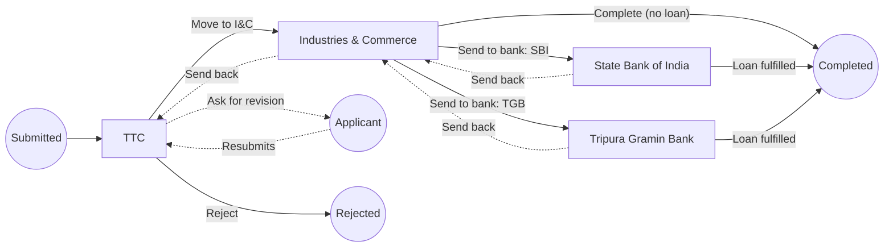

# Pipelines: how an application is worked

An application's route after it is submitted is **configured, not coded**.
The programme office describes it as a **pipeline**:

- the **stages** a file passes through;
- the **roles** that work each stage;
- the **actions** available at each stage;
- what each action **asks** the officer;
- what each action **does** to the file.

Nothing in the code knows a stage's name. The TTC → Industries & Commerce →
bank route below is data, and a future route is a new pipeline rather than a
release.

This guide is the reference for authoring and working pipelines. Related
guides:
- [Form template guide](form-template-guide.md): the questions an application asks.
- [RBAC](admin-rbac.md): roles, permissions and who may author a pipeline.
- [Administrator workflow guide](admin-workflow-guide.md): working a file day to day.

## The pieces

### Pipeline and versions

A pipeline has a **key**, a name and a description. Its shape lives in
**versions**:

- **At most one draft at a time.** A draft is edited as a whole and saved
  against its revision number. Two authors cannot interleave half-edits: the
  second save is refused and told the draft changed.
- **Published versions never change.** Publishing freezes the draft. The next
  edit starts a new draft, numbered one higher.

**A cycle pins a published version when it opens, and every application pins
its cycle's.** Editing a pipeline therefore never re-routes a file already being
worked. A pipeline can be **retired**, which stops new cycles choosing it;
cycles already using it are unaffected.

### Stages and their owners

A stage has:
- a key and a name for the office;
- an applicant-facing label and explanation, which is what the applicant sees
  while their file is there;
- optional **presence flags** (below);
- its **actions**.

**Owners** are the roles that work a stage.

- **Ownership is not versioned.** Adding a second bank officer's role takes
  effect immediately, without publishing a new version. Every change is kept as
  history, with who made it and why.
- **Ownership is what separates two stages that need the same permissions.** A
  State Bank of India officer and a Tripura Gramin Bank officer hold identical
  permissions. They see and act on different files only because each owns a
  different stage.

### Actions

An action is a button at a stage. It has:

| Part | What it is |
| --- | --- |
| **Label**, and an optional **confirmation** | The confirmation is asked before the action is taken; use it for an action that cannot be undone. |
| **Inputs** | What the officer fills in: an amount, a bank, a note, a reference, a date. |
| **Available when** | Conditions over the applicant's answers, the file's flags and its recorded values that decide whether the button is offered. |
| **Effects** | What the action does, each optionally conditional. |

**Inputs use the application form's own field types and bounds, and are
validated by the same engine.** An amount typed by an officer and an amount
typed by an applicant obey one rule. The input types are:

- text and long text;
- date;
- whole number and money;
- yes or no;
- single and multiple choice;
- a statement shown to the officer.

An input can be **pre-filled** from an applicant's answer or a recorded value.
The officer may change the pre-filled value.

### Effects

Every effect type is declared in
[`src/services/catalogue/workflow.json`](../src/services/catalogue/workflow.json)
and carried out by code. **An author combines effects; an author cannot invent
one.**

| Effect | Does | Needs |
| --- | --- | --- |
| `ADD_STATUS` / `REMOVE_STATUS` | Adds or removes a status flag | `stage`/`decide` for an OUTCOME flag, `stage`/`advance` for a PROGRESS flag |
| `SET_RECORDED_VALUE` | Keeps an input as a named value, such as the approved grant, optionally no more than an applicant's answer or the cycle's ceiling | `stage`/`decide` |
| `REQUEST_REVISION` | Hands the file to the applicant to correct the form sections the officer names. The file stays at this stage and **returns here when the applicant resubmits**. | `stage`/`request_revision` |
| `NOTIFY_APPLICANT` | A message on the applicant's timeline, and by email when set | nothing extra |
| `ADD_INTERNAL_NOTE` | Keeps a long-text input as a staff-only note | `application`/`note` |
| `MOVE_TO_STAGE` | Sends the file to a fixed stage | `stage`/`advance` |
| `MOVE_BY_CHOICE` | Sends the file to the stage a choice input names; **every option must be routed** | `stage`/`advance` |
| `RETURN_TO_PREVIOUS` | Sends the file back to the stage **it actually came from**, never a configured one | `stage`/`return` |
| `COMPLETE_PIPELINE` | Ends the journey successfully, with a terminal flag | `stage`/`advance` |
| `CLOSE_APPLICATION` | Ends the journey without success, such as a rejection, with a terminal flag | `stage`/`close` |

**An action needs every permission its effects need, and the officer must also
own the stage.** The permission comes from the effect, never from the author, so
an approval cannot be made cheaper by calling it something else.

### Status flags

An application's status is **the set of flags it holds**. For example,
`[IN_REVIEW, GRANT_APPROVED, BANKING_STAGE]` becomes
`[GRANT_APPROVED, LOAN_APPROVED, COMPLETED]`.

A pipeline declares its own flags. Each flag has:

- a label for the office and one for the applicant, an explanation, and whether
  the applicant sees it at all. The explanation is shown to the applicant as
  written when the flag is visible to them, so write it for them;
- a **kind**: PROGRESS, for movement, or OUTCOME, for a decision. Adding or
  removing an OUTCOME flag needs `stage`/`decide`;
- **`terminal`**: holding it means the journey is over. The file sits at no
  stage and no action is offered;
- **`applicantEdit`**: `REVISION_SCOPED` hands the pen back to the applicant for
  the named sections. This is the one property that loosens the applicant's
  lock, so only `REQUEST_REVISION` may add such a flag, and only the applicant's
  resubmission removes it.

Two kinds of flag are added automatically:
- **Presence flags** belong to a stage. They are added when a file arrives and
  removed when it leaves, so "at the bank" can never outlive the file being at
  one.
- **Submission flags** (`onSubmit`) are added the moment a file is submitted.

### Recorded values

These are named values an action keeps on the file: the grant approved, the
loan sanctioned, a bank's reference. Each has a type and a label, and says
whether the applicant sees it. Conditions and eligibility rules can read them.

### Conditions

Conditions follow the same combinator as form conditions: **conditions sharing a
group must all hold, and any group holding is enough.** A condition compares one
of these:

| Source | Reads |
| --- | --- |
| `ANSWER` | an answer on the submitted form (its type is declared, and checked against each cycle's form) |
| `STATUS_FLAG` | whether the file holds a flag (`IS_PRESENT` / `IS_ABSENT`) |
| `RECORDED_VALUE` | a value an earlier action kept |
| `INPUT` | what the officer entered, which is only meaningful for an effect's own condition, never for whether the action is offered |

A condition that names something that does not exist is **false, never true**.
A configuration that cannot be evaluated never unlocks an action.

## The journey of one file

1. **Submission.** The applicant submits. The file enters the pipeline's first
   stage and gains its submission flags.
2. **An owner acts.** The system first checks that:
   - the file is at the stage the officer was looking at;
   - the action is offered for this file;
   - the inputs are valid;
   - the officer holds every permission needed.

   It then applies every effect in **one guarded write**. Two officers acting at
   once cannot both land: the second is told the file changed.
3. **Revision.** A `REQUEST_REVISION` hands the file to the applicant. They can
   edit only the sections named. When they resubmit, the file returns **to the
   stage that asked**, not to the start.
4. **Send-back.** `RETURN_TO_PREVIOUS` walks back along the file's own trail. A
   file routed to the Tripura Gramin Bank that is sent back returns to
   Industries & Commerce, which may then route it to the State Bank of India.
5. **The end.** A terminal flag ends the journey, which then reads as completed
   or closed by that flag's label.

## Worked example: Mission SEP

This is the pipeline the portal ships as its starting point
([`src/services/pipeline/example.ts`](../src/services/pipeline/example.ts)). It
reads five answers from the default form:
- `WANTS_GRANT` and `SEED_FUND_REQUESTED_PAISE`;
- `WANTS_BANK_LOAN`, `LOAN_BANK_FIRST_CHOICE` and `LOAN_AMOUNT_REQUESTED_PAISE`.

| Stage | Owner role | Actions |
| --- | --- | --- |
| **TTC** | TTC | **Ask the applicant to correct it**: revision, with the `REVISION_REQUIRED` flag. **Move to Industries & Commerce**. **Reject**: a reason as a staff note; closes with `REJECTED`. |
| **Industries & Commerce** | I&C | **Send back with a note**. **Approve the grant**: an amount pre-filled from the request, no more than asked or than the cycle's ceiling. Adds `GRANT_APPROVED` and records it; the file stays here. Offered only if a grant was asked for and not yet approved. **Send to the bank**: a bank choice pre-filled from the applicant's first choice, which routes the file to that bank. Offered only if a loan was asked for. **Complete (no loan asked for)**. |
| **State Bank of India** / **Tripura Gramin Bank** | SBI Bank / TGB Bank | **Send back with a note**. **Mark the loan fulfilled**: amount, reference and sanction date. Adds `LOAN_APPROVED`, records all three and completes with `COMPLETED`. |

Flags: `IN_REVIEW` (added on submission), `REVISION_REQUIRED`,
`GRANT_APPROVED`, `BANKING_STAGE` (presence flag of both bank stages),
`LOAN_APPROVED`, `COMPLETED` and `REJECTED` (both terminal).

## What a pipeline may not do

These are refused when a draft is published, with every problem listed at once:

- a stage no route reaches, or no action leaves;
- a pipeline no file can ever finish;
- an action that moves the file to two places, or moves it and hands it to the
  applicant at once;
- a choice route that misses an option, or routes one that does not exist;
- a terminal flag added by anything but `COMPLETE_PIPELINE` or
  `CLOSE_APPLICATION`;
- an editing flag added by anything but `REQUEST_REVISION`;
- a return from the stage files enter at;
- an action that needs no permission at all;
- a reference to a stage, flag, input or recorded value that does not exist.

**When a cycle opens on a pipeline**, every answer the pipeline reads must be a
top-level question of that cycle's form, of the type the pipeline expects. A
pre-filled choice must not be able to arrive with an option its input does not
offer.

## The API

Everything here sits under the staff namespace. Authoring and casework are two
services with two namespaces, and each checks its own permissions.

### Authoring: `admin.pipeline`

| Operation | Needs | Does |
| --- | --- | --- |
| `list`, `byKey(key)` | `pipeline`/`read` | Every pipeline, or one with its versions, its draft (the document as JSON text, plus every problem it has), its published version, and each stage's live owners |
| `catalogue` | `pipeline`/`read` | The vocabulary the editor offers: effects with their parameters and the permission each needs, input types, condition sources, parameter kinds, form and eligibility rules, and the worked example as JSON text |
| `validateDraft(definition)` | `pipeline`/`read` | Every problem in a document, without saving it |
| `publishedChoices` | `pipeline`/`read` | The pipelines a cycle may choose: published and not retired |
| `create` | `pipeline`/`create` | A pipeline with its first draft, empty or started from the example |
| `saveDraft` | `pipeline`/`update` | Replaces the whole draft |
| `publish` | `pipeline`/`publish` | Freezes the draft as the next version |
| `discardDraft` | `pipeline`/`update` | Throws the draft away |
| `retire` | `pipeline`/`retire` | Stops new cycles choosing it, with a reason |
| `setStageOwners` | `pipeline`/`assign` | Replaces a stage's owner roles, with a reason |

- **The definition travels as JSON text**, at most 48 KB. It is too deep for
  the bounded `JSON` scalar that carries answers, and 48 KB is what fits in the
  API's 64 KB request limit beside the rest of the request. The worked example
  is about 13 KB. The table's own 256 KB CHECK is only a storage backstop.
- **A draft is saved whole against its revision.** A save quoting an old
  revision is refused as stale. `expectedRevision: 0` starts the next draft,
  and only when there is none.
- **A document that parses is saved even with problems**, and they come back
  with it, so work in progress is never lost. A document that does not parse,
  or is too large, is refused.
- **Publishing re-checks the stored draft** and refuses with its problems
  listed. It also creates the rows the version's stages are referenced by.
- **Owners can be set before publishing.** Every stage a saved draft names is
  given a row at once.
- **Handing a stage to a role has a ceiling.** Every role added or removed must
  be within your own permissions, and you must own the stage yourself. A super
  administrator passes both.
- **Invitations carry the same ceiling:** you may offer a role only if you own
  every stage it owns. Accepting re-checks this against the inviter's stages
  at that moment.
- **Every write is one statement with its audit row.** A stale write records
  nothing.

### Casework: `admin.stage`

| Operation | Needs | Does |
| --- | --- | --- |
| `myStages` | a stage you own | Your stages (every published stage, for a super administrator), each with how many files wait there |
| `queue` | owning that stage | One stage's files, oldest first, filterable by the flags they hold, paged by cursor |
| `application(applicationId)` | read scope (below) | Where the file is: stage, trail, flags, recorded values, open corrections, its history, and the actions offered to *you*, each with its input form and pre-filled values |
| `takeAction` | the stage **and** every permission the action's effects need | Validates the inputs and applies every effect in one write |
| `withdrawRevision` | the stage and `stage`/`request_revision` | Withdraws an open correction made in error, with a reason |

**Who can read a file:**
- files at a stage you own;
- files you have acted on, read-only;
- every submitted file, with `application`/`read`. Acting still needs
  ownership.

The same scope is repeated inside every read of a file's workspace, documents
and notes, and in the office-wide queue.

**What each offered action tells the screen.** `permitted` says whether you may
take it, using the same check `takeAction` runs, so a screen never offers a
button that will be refused. `requestsRevision` says it hands the file to the
applicant: `takeAction` then needs `revisionRequests`, naming at least one
section of the file's own form, each with a note.

**`takeAction` refuses, in this order:**
1. the file does not exist or is outside your scope;
2. the file changed since you read it (`expectedStatusVersion`) or is no longer
   at the stage you were looking at;
3. the action is not one this stage offers;
4. you do not own the stage, or lack a permission its effects need;
5. the action is not available for this file now;
6. it is your own application and you did not say so (`selfReviewDisclosed`);
7. the inputs are invalid (returned as `issues`, in the form's own shape);
8. the plan is refused, such as an amount above the applicant's request or the
   cycle's ceiling;
9. the correction requests are missing or name sections the form does not have.

**It costs three round trips, whatever the action does:** the session, one
read of the file's context, and one statement that writes the head, the
action's row, correction requests, notes, timeline events and audit rows
together. Two officers acting at once cannot both land: the second writes
nothing and is told the file changed. Emails go out after the write; one that
fails is recorded as `SEB.STAGE_NOTIFICATION_FAILED` or
`SEB.REVISION_NOTIFICATION_FAILED`, and the action still stands.

The result is small (the new status version, stage and flags, and whether the
journey ended). A screen reads `application` again to show the new state.

**An officer acting on their own application** must set `selfReviewDisclosed`.
The action is then recorded with `SEB.SELF_REVIEW_DISCLOSED` beside it.

**Limits:** `takeAction` allows 60 a minute per session and `saveDraft` 30.

### The applicant's side

`Application.journey` is what the applicant sees:
- the current stage's applicant label and explanation, or how the journey ended;
- only the flags and recorded values the pipeline marks applicant-visible,
  such as the approved grant.

Officer inputs, notes and flags the applicant is not meant to see never reach
this field.

## The screens

### Authoring a pipeline

**`/admin/pipelines`** lists every pipeline with its key, the version cycles
would pin now, whether it has a draft, and whether it is retired. "New pipeline"
(with `pipeline`/`create`) asks for a name, a key that follows the name until
edited, a description, and whether to **start from the example** — the
TTC → Industries & Commerce → bank route above. Otherwise the draft starts
with one empty stage.

**`/admin/pipelines/$key`** is the editor. Its tabs:

| Tab | What it edits |
| --- | --- |
| **Flow** | Nothing: it draws the route. Stages run left to right by how far they are from where files enter; moves are solid arrows, returns and revisions dashed, endings green when they complete and red when they close. A stage no route reaches is drawn dashed on its own. Clicking a stage opens it. |
| **Stages** | Each stage's name, the label and explanation the applicant reads while their file is there, its presence flags, and which stage files enter at |
| **Status flags** | Each flag's office and applicant labels, explanation, whether the applicant sees it, its kind, whether it is terminal, whether it hands the applicant the pen, and which flags a submission adds |
| **Recorded values** | Each value's label, type and whether the applicant sees it |
| **Actions** | Per stage: each action's label, description and confirmation; its inputs; when it is offered; and its effects, built from the catalogue with a control per parameter. The permissions an action will need are shown beside it, so an author sees which roles can press it before anybody tries. |
| **Owners** | Which roles work each stage (see below) |
| **Versions** | Every version, which one cycles pin, which is the draft, and each publish's note |

The toolbar:
- **Check** lists every problem in the working copy. Each problem is a link to
  the tab, stage and action it is about.
- **Save draft** replaces the whole draft against its revision. If somebody
  else saved in between, the editor offers to load their draft.
- **Publish** asks for a change note and a confirmation. It publishes what is
  **saved**, so it is not offered while there are unsaved changes.
- **Discard draft**, and **Retire** with a reason.
- **Start a new draft** when there is none: from the published version, or
  from the example if nothing is published yet.

Renaming a stage, flag, recorded value or input rewrites every reference to it.
The browser warns before leaving with unsaved changes. Without
`pipeline`/`update` the editor is read-only; each other control asks for its
own permission.

**Owners** are set in a dialog per stage: a role picker and a reason, guarded
by the owner list's version. The change takes effect at once and is never
published. The dialog lists roles through the roles screen's own read, so it
needs `role`/`read` too; the server holds the ceiling and the dialog shows its
refusal in the server's words.

### Choosing a pipeline for a cycle

The cycle editor's policy form chooses the pipeline from the published,
unretired ones, and declares the cycle's kinds of application with their
eligibility rules, each parameter drawn with the same control the pipeline
editor uses. Its last step, **Answer rules**, declares the form's rules about
several answers at once. Opening the cycle is what checks that the pipeline can
read the form.

### Working a stage

**My stages** (`/admin/stages`, and the same cards on the office home) shows
one card per stage the person works, grouped by pipeline, with how many files
wait there. Each opens the **stage queue**
(`/admin/stages/$pipelineId/$stageKey`): its files oldest arrival first, how
long each has waited, its flags and recorded values, a flag filter held in the
address, and "Load more".

The application page's **stage panel** shows where the file is (or how its
journey ended) and what the applicant is told, the trail, flags and recorded
values, open corrections with **Withdraw** and a reason, the stage history, and
the actions offered. An action the reader may not take is disabled with the
reason, from the same check `takeAction` runs.

An action opens a **dialog** that draws its inputs with the applicant's own
form renderer, pre-filled with the action's defaults:
- an action that asks for corrections adds a picker for the sections of the
  file's form, each with a note;
- an action with a confirmation shows it above the button;
- on the officer's own application, a box to say so must be ticked;
- a refused input is shown against its field;
- if somebody else acted first, nothing is written and the dialog offers
  **Reload the file**.

**The office-wide list** (`/admin/queue`) is for finding rather than working.
Beyond its existing filters, it filters by pipeline, stage and the flags a
file holds, shows each file's stage and what was asked for, and keeps the
whole filter set in the address. Stage and flag choices are named from the
published pipeline, which needs `pipeline`/`read`; without it the stage filter
offers the reader's own stages and the flag filter is not shown.

### What the applicant sees

The applicant's application page reads the journey: Draft, then Submitted, then
the stage's applicant label or how the journey ended; the explanation beneath
it; the statuses the applicant may see as chips; and a **Decided so far** card
listing the values the office recorded for them, such as the approved grant.
Their list and dashboard show the same standing, and say "Changes requested"
while a correction waits on them.

## The catalogue, and adding to it

[`src/services/catalogue/workflow.json`](../src/services/catalogue/workflow.json)
is the vocabulary a pipeline, a cycle's application kinds and a form's
cross-field rules may use:
- input field types, condition sources and parameter kinds;
- form rules, eligibility rules and effects.

It is authored as JSON and consumed as generated TypeScript
(`npm run workflow-catalog:generate`).

**Every entry must be backed by code, and every piece of that code must be
declared in the file.** `npm run check:workflow-catalog` fails the build on
either side drifting:

| Entry | Code |
| --- | --- |
| Effect | a handler `defineEffect('KEY', …)` in `src/services/pipeline/effects/` |
| Effect's permission | a pair in `src/services/auth/catalog.json` |
| Parameter kind | a validator `defineParamKind` in the pipeline service **and** an editor control `defineParamControl` in the client |
| Condition source | a reader `defineConditionSource` |
| Form rule | a server evaluator `defineFormRule` **and** a client one `defineClientFormRule` |
| Eligibility rule | an evaluator `defineEligibility` |
| Input field type | a form field type the renderer draws |

`test/service/workflow-catalogue.test.ts` proves two further things: each
handler's parameter schema is exactly what the catalogue declares, and the API's
enums are the catalogue's sets.

**To add an effect:**
1. Declare it in the JSON, with its parameters, their kinds and the permission
   it needs.
2. Regenerate.
3. Write its handler as one file under `effects/`: a strict parameter schema,
   the permissions, document checks if any, and a pure `plan`.
4. Register it in `effects/index.ts`.

The build names anything you missed.
